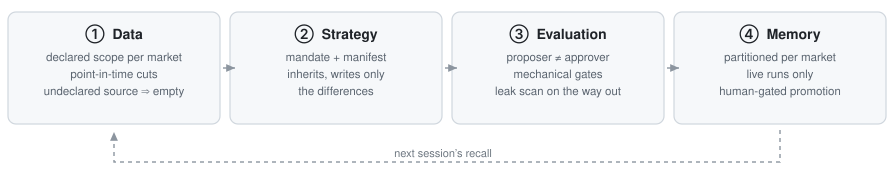
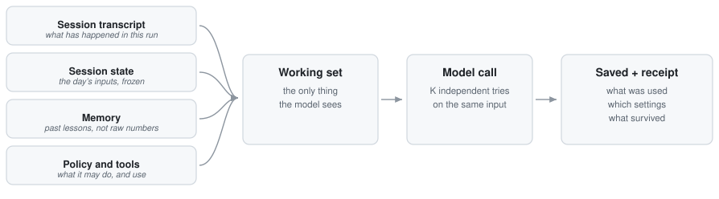
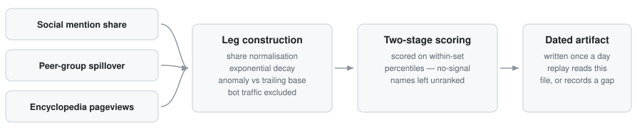

# Jack Tang

**Hong Kong.** Buy-side execution 2023–2025 — equities, futures and IPO dark pool across six
Asian and European markets. Since then I have been building the other half of that job: the
system that decides what is worth trading, and the checks that show whether it was right.

**The code isn't here.** I built the system below with a partner and the work belongs to both
of us, so what I publish is how it was designed, not the source. This page is for someone who
has my CV open and wants to know whether the projects line is real. Judge it on whether these
are decisions a person actually had to make.

| Published here | Deliberately withheld |
|---|---|
| The architecture, and why it is built that way | Source code |
| The design rules, as principles | Live thresholds, weights, universe definitions |
| How changes are evaluated, and the failures behind it | Prompts and mandates |
| The shape of the data pipeline, and what broke | Any position, ticker or performance figure |

---

## TradeAgent — an AI research system for US equity event trading

A multi-agent LLM system built on the Claude Agent SDK and LangGraph. It runs scheduled
sessions across US, European and Japanese earnings universes and produces one auditable book
of verdicts per run — direction, entry, exit, conviction, thesis, invalidation. It writes
analysis, not orders: **the system has no code path that can place an order.** The capability
is not there at all; it is not a switch someone turned off.

`~305 of 772 commits` · `29 architecture decision records` · `3 market sessions daily`

---

## Architecture — data, strategy, evaluation, memory

Four layers, each responsible for one kind of decision. The split exists so that a new idea is
a directory you copy, not a branch you maintain.

<picture>
  <source media="(prefers-color-scheme: dark)" srcset="assets/four-layer-dark.svg">
  
</picture>

**① Data — an agent can only read what it has declared.** Each market's agent lists the
sources it is allowed to use, and the list is checked where the data is actually read: an
undeclared source comes back empty and is recorded on the run receipt, instead of quietly
working. One market can read another's data, but only if that is written down first.
Historical runs follow stricter rules — the generator has no network access, a source that
cannot answer "as of that date" returns nothing rather than today's value, and the shared
price database is read-only. A number that did not exist on the day cannot go into a decision
dated that day.

**② Strategy — a strategy is a directory, not a fork.** The first version of any research agent
is a script with the trader's judgment written into it; the second version is that script
copied six times. Here a strategy is a folder of files: a mandate saying what the model must
think about, a manifest holding the parameters, and thresholds enforced in code so the model
cannot argue its way around them. A new variant inherits the original and only writes down what
differs. It then runs alongside production in its own workspace and cannot write to the
production ledger at all, until a person promotes it with a one-line change that is easy to
undo.

**③ Evaluation — the model that proposes an idea never approves it.** Approval is a separate
stage with its own settings, and anything that can be checked by arithmetic is checked in code
rather than argued in prose. Before results are saved, a scan looks for information the system
could not have had at the time — a result that had already been published, a date calculation
that is off by a day, a report from the future. In a historical replay that scan voids the whole
day; in a live run it raises an alert. Live runs and historical replays are scored by the same
code, because if you score them differently, everything you learn offline is about a system you
are not running.

**④ Memory — nothing is stored permanently without a person approving it.** Each market keeps
its own lessons, and there is one narrow shared channel between them, so a mistake in Tokyo
cannot quietly become an assumption in New York. Overnight, the system drafts lessons from the
positions that closed that day, but each one waits for a person to approve it before it is
stored — and it only learns from live sessions, so an experiment can never teach the book
something that never actually happened.

<b>Four rules the prompt is not allowed to talk you out of</b>

 

Prompts drift. Someone loosens a mandate late one night, and three weeks later the system is
doing something nobody decided. The defence is to keep the rules that must never break out of
the model's reach — in code, in the gates — and to treat any violation as a bug, whatever the
prompt says.

| | Rule | What it means in practice |
|---|---|---|
| **01** | **The proposer is not the approver** | The model that generates an idea never approves it. Approval is a separate stage with its own settings. No agent marks its own work. |
| **02** | **Do nothing by default** | The resting state is to stay out. Entering early requires a specific unlocked path whose numeric conditions are judged by code. **Skipping is a valid answer — there is no quota of ideas.** |
| **03** | **No hindsight** | The position has to be complete before the result is published. Historical runs are sandboxed and scanned for leaks, and that is never loosened to make a backtest look better. |
| **04** | **No way to trade** | Analysis, email, dashboard. The ability to place an order does not exist in the codebase, which is what makes the claim checkable instead of just promised. |

### What the model actually sees on each run

<picture>
  <source media="(prefers-color-scheme: dark)" srcset="assets/harness-dark.svg">
  
</picture>

The model remembers nothing between runs. Each run, the system assembles a working set and
hands it over — that set is everything the model can see. So if you cannot say exactly what
went into it, you cannot explain the output, and you certainly cannot reproduce it a month
later. Every run therefore leaves a receipt answering five questions: **what started it · which
data it read · under whose permissions · what it ran · what survived.** A run that cannot answer
them is a story, not a result.

---

## Evaluation — telling a real improvement from noise

These pipelines are stochastic: run the same day twice and the book comes out different. That
makes the normal instinct — change a prompt, look at the output, ship it — genuinely dangerous,
because on any given day the difference you are looking at is usually noise, and you will
confirm whatever you were hoping for. So a change is measured against a baseline instead.

| | Level | The question it answers |
|---|---|---|
| **L1** | Stability | How much do two identical runs differ? Repeating a run measures the noise, which is the yardstick for everything else. |
| **L2** | Unit and judgment tests | Does the evaluator judge correctly? Ordinary tests, plus a hand-labelled set of ideas it has to classify the way a trader would. |
| **L3** | Frozen replay gate | Would this change have broken a real day? The whole graph is replayed against a fixed past date; if it fails, the change does not ship. |
| **L4** | Attribution | Was the effect real, or just that week? Every run records which configuration produced it, so months of paper results can be grouped by version. |

**A change to how the system behaves only counts if its effect is about twice the size of the
L1 noise.**

<b>Two cases worth reading</b>

 

**A gate that had never actually caught anything.** The frozen-replay gate only loaded part of
its sandbox — the price cache, but not the earnings calendar. So any strategy that picked names
from a fixed pool found an empty pool, and passed in a few seconds against nothing at all. It
had been reporting success for its entire history. The lesson is not the bug: a gate that has
never failed deserves suspicion, and "the tests pass" is a statement about the tests.

 

**The timing signal had become the argument.** The generator could see the numeric conditions
that unlock an early entry, and it started giving them as the *reason* for the trade — a timing
trigger presented as an investment case. The obvious fix is to delete the data; the better fix
was to change who can see it. The evidence moved to the approval stage only, so the trigger
still fires and the flags still compute, but the generator can no longer use them as an
argument. Its use of that vocabulary went **from 1,741 occurrences to zero, and the number of
accepted ideas did not change.**

<b>Data engineering — crowding data, stored as of the day it was true</b>

 

<picture>
  <source media="(prefers-color-scheme: dark)" srcset="assets/crowding-dark.svg">
  
</picture>

Retail attention is mostly useful as a contrarian signal: a name everyone has already found is
a name whose move may already be over. It is also the kind of data that quietly ruins a
backtest, because the convenient sources only know about *now* — ask them about last March and
they answer with today. So each input is normalised, decayed, and compared against its own
recent baseline; names are ranked only against the others that are active that day, not against
the whole universe; and the result is written once a day to a dated file that a replay either
reads or records as missing. A name with no attention at all is marked *unranked*, never zero —
no signal is not the same as no interest.

**Field note.** One input covered only a fifth of the universe for weeks before anyone asked
why. The upstream API was rate-limiting silently: it returned success, and returned nothing.
Slowing the requests down and adding retries took coverage from **386 to 1,924 names**
overnight. Silent failures are the ones worth designing against — an error you can see costs
you an afternoon, a wrong number you trust costs you a quarter.

---

## Tooling

- **Research desk** (Plotly Dash) — records every accepted idea at that day's close and tracks
  it until its exit rule fires, so the record builds up whether or not anyone is watching. It
  only reads what the pipeline produces and never writes back, so a dashboard bug cannot
  corrupt the research record.
- **Post-print review agent** — reads the SEC 8-K filing after results are published and
  calculates the change in guidance in code, rather than asking the model to read it off the
  page.

---

## Background

| | |
|---|---|
| **2024–2025** | Trader, Hong Kong buy-side fund. 100+ orders daily across six markets; ran a USD 1m prop book. SFC Type 1 licensed representative. |
| **2023–2024** | Investment analyst, Hong Kong. Multi-asset execution and allocation proposals for high-net-worth clients. |
| **2022** | Equity research intern, CLSA (return offer). |
| **Education** | BSc Actuarial Science, University of Hong Kong · visiting student, UC Berkeley |
| **Languages** | English, Mandarin, Cantonese |

---

Research and engineering notes only. Nothing here is investment advice, an offer, or a
solicitation. Views are my own and not those of any employer or collaborator.
