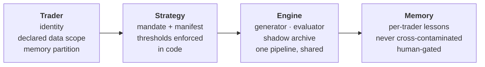
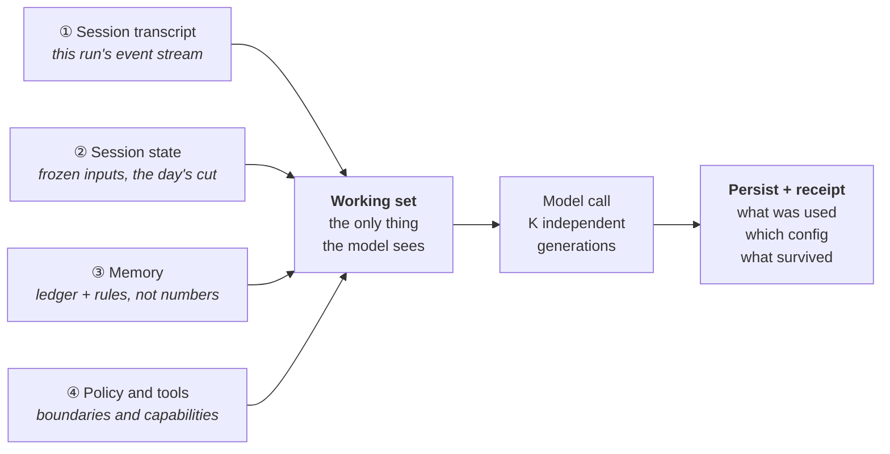
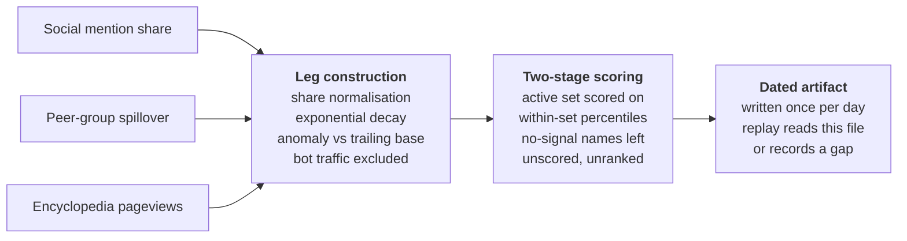

# Jack Tang

**Hong Kong.** Buy-side execution 2023–2025 — equities, futures and IPO dark pool across six
Asian and European markets. Now building the other half of that job: the machinery that
decides what is worth trading, and the discipline that lets you check whether it was ever
right.

**The code isn't here.** I co-built the system below with a partner and the work is jointly
ours, so what I publish is design reasoning, not source. This page is written for someone who
has my CV open and wants to know whether the projects line is real — judge it on whether
these are decisions a person actually had to make.

| Published here | Deliberately withheld |
|---|---|
| Architecture, and the reasoning behind it | Source code |
| Design invariants, as principles | Live thresholds, weights, universe definitions |
| Evaluation methodology, and the failures behind it | Prompts and mandates |
| Data pipeline shape, and what broke | Any position, ticker-level output or performance figure |

---

## TradeAgent — an AI research system for US equity event trading

A multi-agent LLM system built on the Claude Agent SDK and LangGraph. It runs scheduled
sessions across US, European and Japanese earnings universes and emits one auditable book of
verdicts per run — direction, entry, exit, conviction, thesis, invalidation. It produces
analysis, not orders: **there is no order-placing code path in the system** — an absent
capability, not a disabled flag.

`~305 of 772 commits` · `29 architecture decision records` · `3 market sessions daily`

---

### Architecture — a strategy should be a directory, not a fork

The first version of any research agent is a script with the trader's judgment baked into it.
The second version is that script copied six times. Four layers, each owning exactly one kind
of decision: a **trader** is an identity — which markets it may read, which memory it writes —
and its data scope is *enforced at the read seam*, so an undeclared source returns empty
rather than quietly working. A **strategy** is a pack of files: a mandate, a manifest, and
thresholds enforced in code that the model cannot re-argue in prose.

> The engine is the console, a strategy is the cartridge, the trader is the logged-in user.

A variant is a copied directory. It runs in its own namespace as a trial arm and is
*structurally* unable to write the production ledger until a human promotes it.

---

### The harness — context is assembled, not remembered

The model knows nothing between runs. Every run, something assembles a working set and hands
it over — and if you cannot say precisely what was in it, you cannot explain the output, let
alone reproduce it a month later. Every receipt answers five questions: **what woke it ·
which state it read · under whose authority · what it executed · what survived.** A run that
cannot answer them is not a result. It is an anecdote.

---

### Evaluation — a change is real only if it clears the noise

LLM pipelines are stochastic; run the same day twice and the book differs. That makes the
ordinary engineering instinct — change a prompt, eyeball the output, ship it — actively
dangerous: you will confirm every hypothesis you bring, because on any given day the noise is
larger than the effect. So "did this change work?" is answered against a measured baseline.

| | Rung | The question it answers |
|---|---|---|
| **L1** | Stability | How loud is the room? Repeat an identical run to measure the noise band — the denominator for everything above it. |
| **L2** | Unit and judgment sets | Does the brain judge correctly? Deterministic tests, plus a hand-labelled set the evaluator must classify the way a trader would. |
| **L3** | Frozen replay gate | Would this change have broken a real day? Graph-level replay at a fixed as-of date; non-zero exit means it does not ship. |
| **L4** | Attribution | Was the effect real, or was it Tuesday? Every run stamps its config hash, so months of paper results group by the version that produced them. |

**A behaviour-shaping change counts only if its effect clears roughly two standard deviations
of the L1 band.** And the same scorer grades live books and historical replays — fork it, and
every offline lesson you learn is about a system you are not running.

<b>Two cases worth reading</b>

 

**A gate that had never bitten.** The frozen-replay gate seeded only part of its sandbox — the
price cache, but not the earnings calendar. Any strategy selecting from a forced pool
therefore faced an *empty* candidate pool and passed in seconds against nothing at all. It had
been reporting green for its entire history. The lesson is not the bug: it is that a gate
which has never failed deserves suspicion, and that "the tests are green" is a claim about the
tests.

 

**The trigger had colonised the thesis.** Quantitative entry-unlock signals were visible to the
generator, and the model began reciting them as the *reason* for the trade — a mechanical
timing trigger laundered into an investment argument. The instinct is to delete the data; the
better fix was visibility routing. The evidence moved to evaluator-only scope, so the trigger
still fires and the flags still compute, but the generator can no longer borrow them as an
argument. Leakage of unlock vocabulary went **from 1,741 occurrences to zero, with
accepted-idea count unchanged.**

<b>Four invariants the prompt is not allowed to talk you out of</b>

 

Prompts drift. Someone softens a mandate at 2am and three weeks later the system is doing
something nobody chose. The defence is to put the rules that must never break where the model
cannot reach them, and to treat any violation as a bug regardless of what the prompt says.

| | Rule | What it means in practice |
|---|---|---|
| **01** | **Proposer ≠ approver** | The model that generates an idea never approves it. Approval is a separate stage with its own configuration. No agent marks its own work. |
| **02** | **Default-wait** | The resting state is to do nothing. Early entry needs a specific unlocked path whose quantitative legs are judged by code. **Skip is a first-class output — there is no idea quota.** |
| **03** | **No lookahead** | The position must be complete before the catalyst prints. Historical runs are mechanically sandboxed with a hard leak scan, never weakened to make a backtest look better. |
| **04** | **No execution path** | Analysis, email, dashboard. The capability to place an order does not exist in the codebase — which is what makes the claim checkable rather than promised. |

<b>Data engineering — crowding, built as a point-in-time artifact</b>

 

Retail attention is useful to an event book mainly as a *contrarian* read: a name everybody has
already found is a name whose move may already be spent. But it is exactly the kind of input
that quietly destroys a backtest, because the convenient sources are all *current* — ask them
about last March and they answer with today.

The design problem was never the signal. It was the archive: a number that did not exist on the
day cannot enter a decision dated that day. Two calls worth arguing about — **absence of
attention is not evidence of neglect** (a name with no signal is scored *not-ranked*, never
zero), and **spillover alone doesn't make a name interesting** (it must show a signal of its
own to enter the active set).

**Field note.** Coverage on the pageview leg sat at a fifth of the universe for weeks before
anyone questioned it: the upstream API was rate-limiting *silently* — returning success,
returning nothing. Polite throttling and a retry path took coverage from **386 to 1,924 names**
overnight. Silent degradation is the failure mode worth designing for. An error you can see
costs you an afternoon; a wrong number you trust costs you a quarter.

---

### Tooling

- **Research desk** (Plotly Dash) — books every accepted idea at end-of-day marks and carries it
  until its exit rule fires. Strictly downstream: it reads the pipeline's artifacts and never
  writes to them, so a dashboard bug cannot corrupt the research record.
- **Post-print review agent** — reads SEC EDGAR 8-K Item 2.02 filings and computes the guidance
  delta *in code* rather than asking the model to read it off the page.
- **Overnight memory layer** — drafts lessons from each day's closed positions, but every
  candidate waits in a review state until a person promotes it. Automated learning with no human
  gate is how a book quietly teaches itself last quarter's regime.

---

### Background

| | |
|---|---|
| **2024–2025** | Trader, Hong Kong buy-side fund. 100+ orders daily across six markets; ran a USD 1m prop book. SFC Type 1 licensed representative. |
| **2023–2024** | Investment analyst, Hong Kong. Multi-asset execution and allocation proposals for high-net-worth clients. |
| **2022** | Equity research intern, CLSA (return offer). |
| **Education** | BSc Actuarial Science, University of Hong Kong · visiting student, UC Berkeley |
| **Languages** | English, Mandarin, Cantonese |

---

Research and engineering notes only. Nothing here is investment advice, an offer, or a
solicitation. Views are my own and not those of any employer or collaborator.
