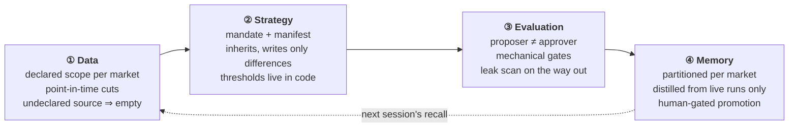
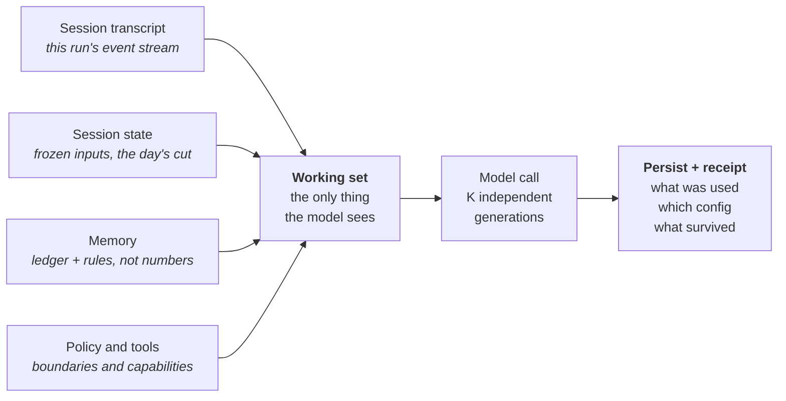

# Jack Tang

**Hong Kong.** Buy-side execution 2023–2025 — equities, futures and IPO dark pool across six
Asian and European markets. Now building the other half of that job: the machinery that
decides what is worth trading, and the discipline that lets you check whether it was ever
right.

**The code isn't here.** I co-built the system below with a partner and the work is jointly
ours, so what I publish is design reasoning, not source. This page is written for someone who
has my CV open and wants to know whether the projects line is real — judge it on whether
these are decisions a person actually had to make.

| Published here | Deliberately withheld |
|---|---|
| Architecture, and the reasoning behind it | Source code |
| Design invariants, as principles | Live thresholds, weights, universe definitions |
| Evaluation methodology, and the failures behind it | Prompts and mandates |
| Data pipeline shape, and what broke | Any position, ticker-level output or performance figure |

---

## TradeAgent — an AI research system for US equity event trading

A multi-agent LLM system built on the Claude Agent SDK and LangGraph. It runs scheduled
sessions across US, European and Japanese earnings universes and emits one auditable book of
verdicts per run — direction, entry, exit, conviction, thesis, invalidation. It produces
analysis, not orders: **there is no order-placing code path in the system** — an absent
capability, not a disabled flag.

`~305 of 772 commits` · `29 architecture decision records` · `3 market sessions daily`

---

## Architecture — data, strategy, evaluation, memory

Four layers, each owning exactly one kind of decision. The point of the split is that a new
idea should be a directory someone copies, not a branch someone maintains.

**① Data — declaring a source is what grants access to it.** Each market's agent carries an
explicit data scope, enforced at the read seam: an undeclared source returns *empty* and is
noted on the receipt, rather than quietly working. Cross-market reads exist, but they have to be
written down. Historical runs sit under harder law — the generator loses network access, a
non-point-in-time endpoint returns nothing on a cache miss instead of reaching for today's
value, and the shared price store is read-only. A number that did not exist on the day cannot
enter a decision dated that day.

**② Strategy — a strategy is a directory, not a fork.** The first version of any research agent
is a script with the trader's judgment baked in; the second is that script copied six times.
Here a strategy is a pack of files: a mandate saying what the model must think about, a manifest
wiring the parameters, and thresholds enforced in code the model cannot re-argue in prose. A
variant inherits its parent and writes only the differences, then runs as a parallel arm in its
own namespace — structurally unable to touch the production ledger until a human promotes it in
a one-line, revertible diff.

**③ Evaluation — the model that proposes an idea never approves it.** Approval is a separate
stage with its own configuration, and any rule that can be checked arithmetically is checked in
code rather than argued in prose. On the way out a leak scan looks for lookahead — a catalyst
that had already printed, a date-maths bug, a future report; in replay it voids the whole day,
live it raises a tripwire. The same scorer grades live books and historical replays: fork the
scorer, and every offline lesson is about a system you are not running.

**④ Memory — nothing durable is written unattended.** Each market keeps its own lessons behind
one deliberately narrow shared channel, so a Tokyo mistake cannot quietly become a New York
prior. The overnight layer drafts lessons from closed positions, but each candidate waits in a
review state until a person promotes it, and it distils from live sessions only — an experiment
can never teach the book something that never happened. Automated learning with no human gate is
how a book quietly teaches itself last quarter's regime.

### Underneath all four — context is assembled, not remembered

The model knows nothing between runs; something assembles a working set and hands it over. If
you cannot say precisely what was in it, you cannot explain the output, let alone reproduce it
a month later — so every receipt answers five questions: **what woke it · which state it read ·
under whose authority · what it executed · what survived.**

---

## Evaluation in practice — a change is real only if it clears the noise

LLM pipelines are stochastic; run the same day twice and the book differs. That makes the
ordinary instinct — change a prompt, eyeball the output, ship it — actively dangerous: you will
confirm every hypothesis you bring, because the noise is larger than the effect you came for.
So the question is answered against a measured baseline.

| | Rung | The question it answers |
|---|---|---|
| **L1** | Stability | How loud is the room? Repeat an identical run to measure the noise band — the denominator for everything above it. |
| **L2** | Unit and judgment sets | Does the brain judge correctly? Deterministic tests, plus a hand-labelled set the evaluator must classify the way a trader would. |
| **L3** | Frozen replay gate | Would this change have broken a real day? Graph-level replay at a fixed as-of date; non-zero exit means it does not ship. |
| **L4** | Attribution | Was the effect real, or was it Tuesday? Every run stamps its config hash, so months of paper results group by the version that produced them. |

**A behaviour-shaping change counts only if its effect clears roughly two standard deviations of
the L1 band.**

**A gate that had never bitten.** The frozen-replay gate seeded only part of its sandbox — the
price cache, but not the earnings calendar — so any strategy drawing from a forced pool faced an
empty candidate pool and passed in seconds against nothing at all. It had been green for its
entire history. The lesson is not the bug: a gate that has never failed deserves suspicion, and
"the tests are green" is a claim about the tests.

**The trigger had colonised the thesis.** Quantitative entry-unlock signals were visible to the
generator, and the model began reciting them as the *reason* for the trade — a timing trigger
laundered into an investment argument. The instinct is to delete the data; the better fix was
visibility routing. The evidence moved to evaluator-only scope: the trigger still fires and the
flags still compute, but the generator can no longer borrow them as an argument. Leakage went
**from 1,741 occurrences to zero, with accepted-idea count unchanged.**

---

## Data engineering — crowding as a point-in-time artifact

Retail attention reads to an event book mainly as a *contrarian* signal: a name everybody has
already found is a name whose move may already be spent. It is also the kind of input that
quietly destroys a backtest, because the convenient sources are all *current* — ask them about
last March and they answer with today. So the legs are normalised, decayed, compared against a
trailing base, scored within the active set rather than the whole universe, and written once a
day to a dated artifact that replay either reads or records as a gap. Absence of attention is
scored *not-ranked*, never zero.

**Field note.** Coverage on one leg sat at a fifth of the universe for weeks: the upstream API
was rate-limiting *silently* — returning success, returning nothing. Throttling and a retry path
took it from **386 to 1,924 names** overnight. Silent degradation is the failure mode worth
designing for: an error you can see costs you an afternoon, a wrong number you trust costs you a
quarter.

---

## Tooling

- **Research desk** (Plotly Dash) — books every accepted idea at end-of-day marks and carries it
  until its exit rule fires. Strictly downstream: it reads the pipeline's artifacts and never
  writes to them, so a dashboard bug cannot corrupt the research record.
- **Post-print review agent** — reads SEC EDGAR 8-K Item 2.02 filings and computes the guidance
  delta *in code* rather than asking the model to read it off the page.

---

## Background

| | |
|---|---|
| **2024–2025** | Trader, Hong Kong buy-side fund. 100+ orders daily across six markets; ran a USD 1m prop book. SFC Type 1 licensed representative. |
| **2023–2024** | Investment analyst, Hong Kong. Multi-asset execution and allocation proposals for high-net-worth clients. |
| **2022** | Equity research intern, CLSA (return offer). |
| **Education** | BSc Actuarial Science, University of Hong Kong · visiting student, UC Berkeley |
| **Languages** | English, Mandarin, Cantonese |

---

Research and engineering notes only. Nothing here is investment advice, an offer, or a
solicitation. Views are my own and not those of any employer or collaborator.
